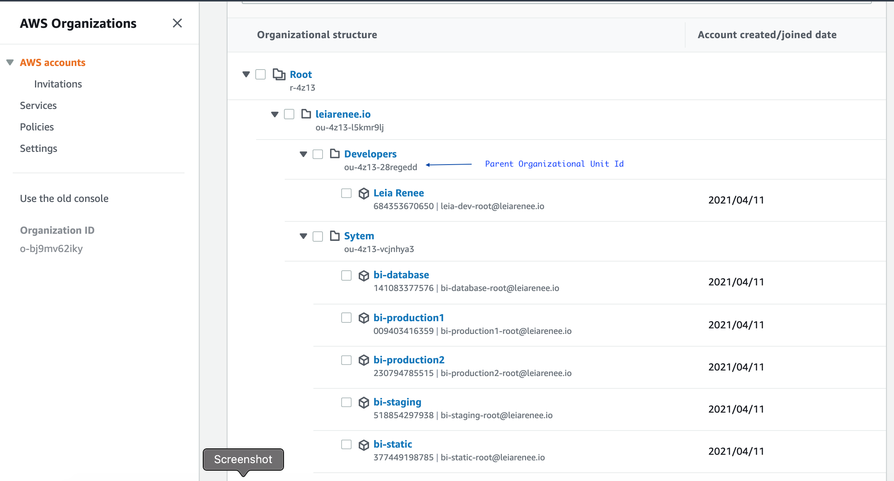

# Nuke Sub Organizational Accounts

Destroys resources in organizational accounts that belong to a specific parent organizational unit.

WARNING: This is a highly destructive tool and will clean up all of your resources including default internet gateway. Exceptions are defined in yaml config file. Read instructions clearly to apply it in your system.

Inspired from blog [Automated Clean Up with aws-nuke in multiple accounts](https://www.1strategy.com/blog/2019/07/16/automated-clean-up-with-aws-nuke-in-multiple-accounts/) published by [1strategy](https://www.1strategy.com/)
## Pre-requisites

* jq - `brew install jq`
* [aws-nuke](https://github.com/rebuy-de/aws-nuke)
* [aws client](https://docs.aws.amazon.com/cli/latest/userguide/install-cliv2.html)

### Usage

* RUN:
  * `./nuke.sh` in the current folder

But before:

* Edit AWS credentials file
  * Enter your master account account credentials in `.aws/credentials` file under a section named as`[master]`  

Ex:

```
[master]
aws_access_key_id = ALIA2J*****SNEU6SRNH
aws_secret_access_key = 3zsz*********rDBxJLm*X*e5z
region = eu-central-1
```

* Install aws-nuke
  * Download [aws-nuke](https://github.com/rebuy-de/aws-nuke/releases)
  * Copy the binary into this folder and rename it as `aws-nuke`
* Edit YAML configuration file
  * Duplicate `example.aws-nuke-config-template.yaml` and rename it as `aws-nuke-config-template.yaml`
  * Edit the configuration file and customize it according to your needs.
    * You may want to change all `cicd`s to your specific user name which you use to access to account.
    * And `*.my-domain.com.` in `Route53HostedZone` section.
* Set Environment variable NUKE_PARENT to parent organizational unit. (edit .envrc if you use direnv)
  * Ex. export NUKE_PARENT=ou-4z13-28regedd
* Install jq if it is not already installed.
  * `brew install jq`
* Install aws client if it is not already installed.


#### Sample AWS Organizational Unit Structure



#### Sample aws-nuke configuration file

```yaml
---
regions:
- "global" # This is for all global resource types e.g. IAM
- "eu-central-1"

account-blocklist:
- 111111111111

accounts:
  000000000000:
    filters:     
      EC2VPC:
      - property: IsDefault
        value: "true"
      EC2Subnet:
      - property: DefaultForAz
        value: "true"
      EC2InternetGateway:
      - property: DefaultForAz
        value: "true" 
      IAMUser:
      - "cicd"
      IAMUserPolicyAttachment:
      - "cicd -> AdministratorAccess"
      IAMRole:
      - "OrganizationAccountAccessRole"
      IAMLoginProfile:
      - "cicd"
      IAMRolePolicyAttachment:
      - "OrganizationAccountAccessRole -> AdministratorAccess"
      Route53HostedZone:
      - property: Name
        type: "glob"
        value: "*.my-domain.com."


resource-types:
  # don't nuke IAM users
  excludes:
  - IAMUser
  - IAMUserAccessKey
```

Notes: Script will run two times by default. Sometimes aws-nuke fails to destroy all resources at first run. In most cases running it more than once solves the problem. You may change it from inside script. (Change the line x=2)

```bash
  # Run aws-nuke
  echo "Running aws-nuke on account $line"
  x=2
  while [ $x -gt 0 ]
  do
    ./aws-nuke -c temp/$line.yaml --force \
    --access-key-id $ACCESS_KEY_ID --secret-access-key $SECRET_ACCESS_KEY --session-token $SESSION_TOKEN \
    --no-dry-run \
    | tee -a temp/aws-nuke.log

    x=$(($x-1))
  done
```

__Reference:__

Inspired from blog [Automated Clean Up with aws-nuke in multiple accounts](https://www.1strategy.com/blog/2019/07/16/automated-clean-up-with-aws-nuke-in-multiple-accounts/) published by [1strategy](https://www.1strategy.com/)

__Note:__ 

Since aws-nuke fails to remove RDS option groups, the following commandline is used to manually remove all RDS option groups. https://github.com/rebuy-de/aws-nuke/issues/637

```
aws rds describe-option-groups | jq -r '.[] | .[].OptionGroupName' | grep -v "default" | xargs -I '{}' aws rds delete-option-group --option-group-name "{}"
```
